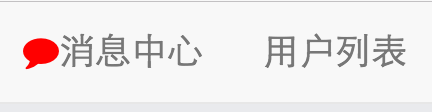

### 已初始化的帐号

| 帐号名| 密码|
| ------------- |:-------------:|
|andy   | 12345678
|xiaobei | 12345678
jon      | 12345678
kitty | 12345678
hello | 12345678
messi | 12345678
kaka  | 12345678

### 开发思路 流程

- 理解需求设计表结构
- 初始化Rails项目
- 创建User对象
- 实现登录页面
- 实现消息中心页面
- 实现A和B的聊天界面
- 实现model层Inbox和Message相关逻辑
- 实现model 的 soft delete
- 前端界面和后端联调
- 添加actionCable
- 部署

### 发消息的详细思路

- 登录成功后, client A 向LettersChannel注册, 订阅消息
- 当 B 向 A 发送消息, 通过服务器 `ActionCable.server.broadcast "letter_notifications_#{self.friend.id}", data` 向 client A 发送消息
- 如果 A 在 消息中心页面
  - 如果 A 和 B 的聊天记录 存在, 则置顶, 并将内容 更新为最新的一条
  - 如果 A 和 B 的聊天记录 不存在, 则创建一条, 放到所有聊天记录的 最顶部

- 如果 A 正在 和 B 的聊天界面中
  - 创建message 的html, 并插入到信息流的最顶部
- 如果 A 在其他页面
  - 高亮 消息中心 旁边的 icon， 如下: 




### 使用流程

```

git clone git@github.com:easyhappy/letter.git
cd letter
bundle install
cp config/database.yml.example config/database.yml
cp config/cable.yml.example config/cable.yml
cp config/redis.yml.example config/redis.yml
cp config/secrets.yml.example config/secrets.yml
rake db:create
rake db:migrate
rake db:seed
rails s

// 然后就可以愉快的玩耍了

```


### 部署服务器

使用fabric在服务器上安装依赖包, 部分代码截图如下

```
fab init_ubuntu:hosts="root@120.76.242.234"
```


### Todo list

- 添加测试
- 404页面
- 优化页面
- 发送消息频率限制
- bla bla ...
