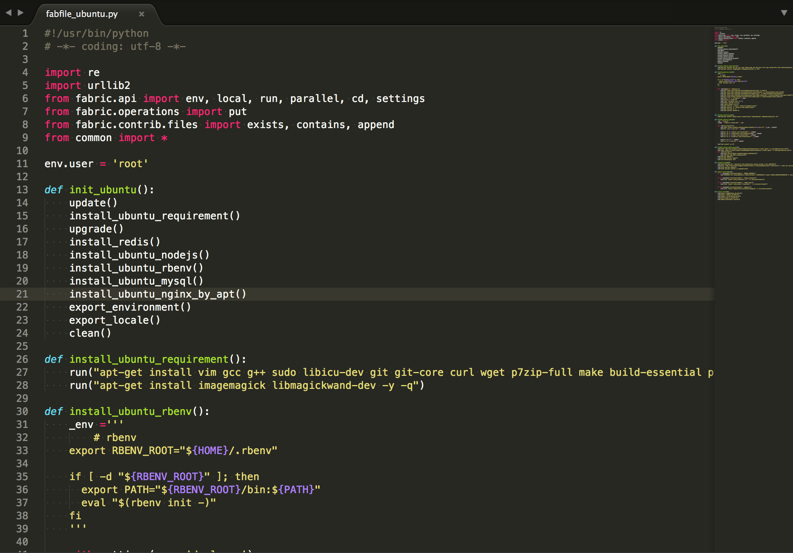

### 一、开发思路 流程

- 理解需求设计表结构
- 初始化Rails项目
- 创建User对象
- 实现登录页面
- 实现消息中心页面
- 实现A和B的聊天界面
- 实现model层Inbox和Message相关逻辑
- 前端界面和后端联调
- 添加actionCable
- 部署


### 二、使用流程

```

git clone git@github.com:easyhappy/letter.git
cd letter
bundle install
cp config/database.yml.example config/database.yml
cp config/cable.yml.example config/cable.yml
cp config/redis.yml.example config/redis.yml
cp config/secrets.yml.example config/secrets.yml
rake db:create
rake db:migrate
rake db:seed
rails s

// 然后就可以愉快的玩耍了

```


### 三、部署服务器

使用fabric部署服务器, 部分代码如下

